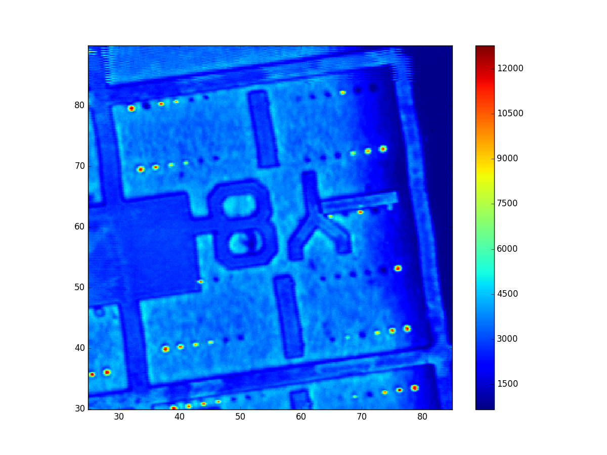
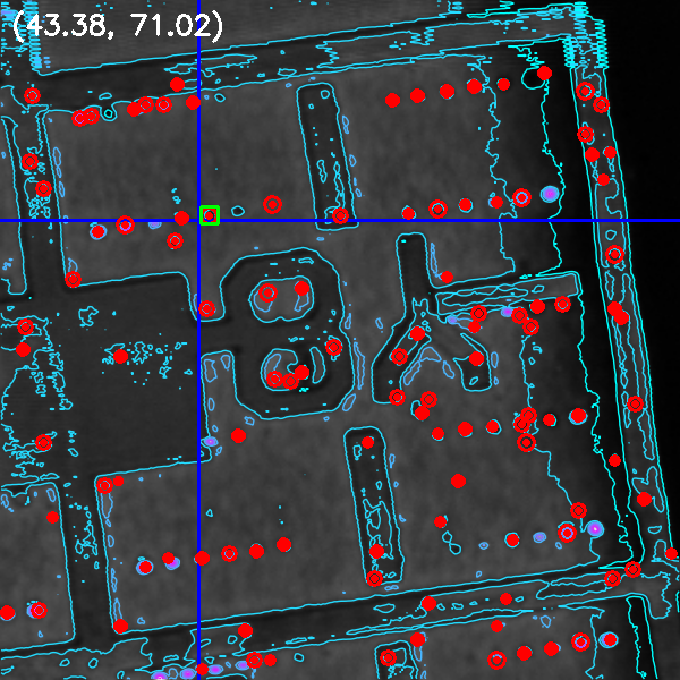
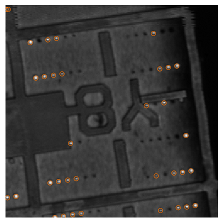

# pyNVscan
基于Python和OpenCV以及微纳加工技术的本组自动化样品检测系统pyNVscan

try improving the scan program of detection nitrogen-vacancy centers in diamond, for auto-run or one-button-run experiment...

## 识别荧光点（潜在的单光子源）
核心点：
对如下扫描图进行识别：来自Z39.00um_dX0.20um_CT80ms10ms.csv(蛇形扫描)



### OpenCV
霍夫圆识别，先添加等高线增强轮廓，如示例程序:pyNVscan_AT_CV_hot_spot.V3.1.py（Python(x,y)2.7.10, OpenCV2）

(pyNVscan_AT_CV_hot_spot.V3.1_o3.py是OpenCV3版本，Anaconda4，Python2.3.13)



### Scipy
二维局域极值识别

test_scipy2.ipynb



```python
    #创建浮点灰度图
    img = Z0 / Z0.max()
    #圈定坐标和筛选
    lm = morph.local_maxima(img)
```
